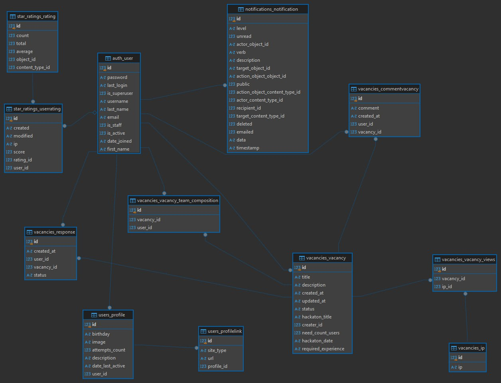

# HackMate
[](https://gitlab.crja72.ru/django/2024/autumn/course/projects/team-5/commits/main)

## Удобный сервис по поиску сокомандников для хакатонов

---

## 📖 Содержание
- [Введение](#🏁-введение)
  - [Возможности HackMate](#возможности-hackmate)
- [Структура проекта](#📂-структура-проекта)
  - [Стек технологий](#стек-технологий)
  - [База данных](#база-данных)
- [Установка](#установка)

- [Авторы](#👥-авторы)

---

## 🏁 Введение
HackMate предоставляет простой и удобный инструмент для поиска сокомандников для хакатонов, чтобы собрать идеальную команду для реализации ваших идей.

### Возможности HackMate
С помощью HackMate вы можете:
- Искать участников по навыкам.
- Формировать команду в несколько кликов.
- Управлять проектами и взаимодействием участников.
- Смотреть историю участия.


---

## 📂 Структура проекта

### Стек технологий
- [Python](https://www.python.org/) ([Django](https://www.djangoproject.com/)) - 3.12 и 4.2 - золотой набор)
- [Django-star-ratings](https://django-star-ratings.readthedocs.io/en/latest/) - чтоб пользователи могли ставить звездочки и оценивать друг друга
- HTML, CSS, JavaScript - для красивой картинки и всяческих динамических изменений)
- [SQLite](https://www.sqlite.org/) - просто и сердито

### База данных
Проект использует реляционную базу данных SQLite. Детали можно найти в разделе [ER-диаграмма](#er-диаграмма).

---
### Установка
- подразумевает загрузку всего необходимого ПО непосредственно на локальную
  машину, с последующей ручной установкой и настройкой каждого компонента.
  Долгий и трудный путь, зато вы имеете полный контроль над всем происходящим

---
## 🚀 Инструкция по запуску

### Клонирование репозитория
Клонируйте проект с помощью команды:
```bash
git clone https://gitlab.crja72.ru/django/2024/autumn/course/projects/team-5.git
```

### Создание виртуальной среды
#### Windows
```cmd
python -m venv venv
```
#### Linux
```bash
sudo apt install python3-venv
python3 -m venv venv
```

### Активация окружения
#### Windows
```cmd
venv\Scripts\activate
```
#### Linux
```bash
source ./venv/bin/activate
```

### Установка зависимостей
- Для продакшн-окружения:
  ```bash
  pip install -r ./requirements/prod.txt
  ```
- Для разработки:
  ```bash
  pip install -r ./requirements/dev.txt
  ```
- Для тестирования:
  ```bash
  pip install -r ./requirements/test.txt
  ```

### Настройка переменных окружения
Перенесите переменные из `.env.template` в `.env`:
```bash
dump-env --template=.env.template --prefix='SECRET_ENV_' > .env
```
Перейдите в каталог `hackmate` и выполните:
```bash
cd hackmate
```
---

## 📊 Миграции базы данных
Проект использует систему миграций для управления изменениями структуры базы данных.

- Создание миграции:
  ```bash
  python manage.py makemigrations
  ```
- Применение миграции:
  ```bash
  python manage.py migrate
  ```

---

## 📦 Фикстуры
Фикстуры помогают загружать и выгружать данные базы данных.

- Загрузка фикстур:
  ```bash
  python manage.py loaddata fixtures/data.json
  ```
- Выгрузка фикстур:
  ```bash
  python -X utf8 manage.py dumpdata --indent 2  your_app > fixtures/data.json
  ```

---

## 📐 ER-диаграмма

---

## 🌐 Интернационализация
Этот проект поддерживает интернационализацию.

### Создание собственной локализации
1. Добавьте язык в `settings.py`:
   ```python
   LANGUAGES = [
       ("ru", django.utils.translation.gettext_lazy("Русский")),
       ("en", django.utils.translation.gettext_lazy("English")),
       ("lang", django.utils.translation.gettext_lazy("Your_language")),
   ]
   ```
2. Создайте конфигурацию локализации:
   ```bash
   django-admin makemessages -l your_lang
   ```
3. Заполните содержимое файла локализации.
4. Компилируйте переводы:
   ```bash
   django-admin compilemessages
   ```

Подробнее о локализации можно прочитать [здесь](https://habr.com/ru/companies/ruvds/articles/498452/).

---
## ✅ Тестирование
Запустите тесты:
   ```bash
   python manage.py test
   ```
---
### Запуск приложения
Перейдите в каталог `hackmate` и выполните:
```bash
python manage.py runserver
```
---


## 👥 Авторы
- **Косьмин Георгий**  
  [GitHub](https://github.com/kiper-acab) | [Telegram](https://t.me/KIPERQW)

- **Шеляг Макар**  
  [GitHub](https://github.com/ShelMakar) | [Telegram](https://t.me/shel_makar)

- **Харазян Левон**  
  [Telegram](https://t.me/l_kharazyan)
------------------------------------------
# HackMate
[](https://gitlab.crja72.ru/django/2024/autumn/course/projects/team-5/commits/main)

## A handy service for finding teammates for hackathons

---

## 📖 Contents
- [Introduction](#🏁-introduction)
  - [HackMate features](#hackmate-features)
- [Project structure](#📂-project-structure)
  - [Technology stack](#technology-stack)
  - [Database](#database)
- [Installation](#installation)

- [Authors](#👥-authors)

---

## 🏁 Introduction
HackMate provides a simple and convenient tool for finding teammates for hackathons, helping you assemble the perfect team to bring your ideas to life.

### HackMate Features
With HackMate, you can:
- Search for participants by skill.
- Form a team in just a few clicks.
- Manage projects and participant interactions.
- View participation history.


---

## 📂 Project Structure

### Technology Stack
- [Python](https://www.python.org/) ([Django](https://www.djangoproject.com/)) - 3.12 and 4.2 – the golden combination)
- [Django-star-ratings](https://django-star-ratings.readthedocs.io/en/latest/) – so users can rate each other with stars
- HTML, CSS, JavaScript – for a nice interface and all sorts of dynamic changes)
- [SQLite](https://www.sqlite.org/) - simple and powerful

### Database
The project uses the SQLite relational database. Details can be found in the [ER diagram](#er-diagram) section.

---
### Installation
- involves downloading all the necessary software directly to your local
  machine, followed by manual installation and configuration of each component.
  It’s a long and difficult process, but you have full control over everything that happens

---
## 🚀 Getting Started Guide

### Cloning the Repository
Clone the project using the command:
```bash
git clone https://gitlab.crja72.ru/django/2024/autumn/course/projects/team-5.git
```

### Creating a virtual environment
#### Windows
```cmd
python -m venv venv
```
#### Linux
```bash
sudo apt install python3-venv
python3 -m venv venv
```

### Activating the environment
#### Windows
```cmd
venv\Scripts\activate
```
#### Linux
```bash
source ./venv/bin/activate
```

### Installing dependencies
- For the production environment:
  ```bash
  pip install -r ./requirements/prod.txt
  ```
- For development:
  ```bash
  pip install -r ./requirements/dev.txt
  ```
- For testing:
  ```bash
  pip install -r ./requirements/test.txt
  ```

### Configuring environment variables
Copy the variables from `.env.template` to `.env`:
```bash
dump-env --template=.env.template --prefix=“SECRET_ENV_” > .env
```
Navigate to the `hackmate` directory and run:
```bash
cd hackmate
```
---

## 📊 Database migrations
The project uses a migration system to manage changes to the database structure.

- Creating a migration:
  ```bash
  python manage.py makemigrations
  ```
- Applying a migration:
  ```bash
  python manage.py migrate
  ```

---

## 📦 Fixtures
Fixtures help to load and unload database data.

- Loading fixtures:
  ```bash
  python manage.py loaddata fixtures/data.json
  ```
- Dumping fixtures:
  ```bash
  python -X utf8 manage.py dumpdata --indent 2  your_app > fixtures/data.json
  ```

---

## 📐 ER diagram

---

## 🌐 Internationalisation
This project supports internationalisation.

### Creating your own localisation
1. Add a language to `settings.py`:
   ```python
   LANGUAGES = [
       (‘ru’, django.utils.translation.gettext_lazy(‘Russian’)),
       (‘en’, django.utils.translation.gettext_lazy(‘English’)),
       (‘lang’, django.utils.translation.gettext_lazy(‘Your_language’)),
   ]
   ```
2. Create a localisation configuration:
   ```bash
   django-admin makemessages -l your_lang
   ```
3. Fill in the contents of the localisation file.
4. Compile the translations:
   ```bash
   django-admin compilemessages
   ```

You can read more about localisation [here](https://habr.com/ru/companies/ruvds/articles/498452/).

---
## ✅ Testing
Run the tests:
   ```bash
   python manage.py test
   ```
---
### Running the application
Navigate to the `hackmate` directory and run:
```bash
python manage.py runserver
```
---


## 👥 Authors
- **Georgy Kosmin**  
  [GitHub](https://github.com/kiper-acab) | [Telegram](https://t.me/KIPERQW)

- **Makar Shelyag**  
  [GitHub](https://github.com/ShelMakar) | [Telegram](https://t.me/shel_makar)

- **Levon Kharazyan**  
  [Telegram](https://t.me/l_kharazyan)
